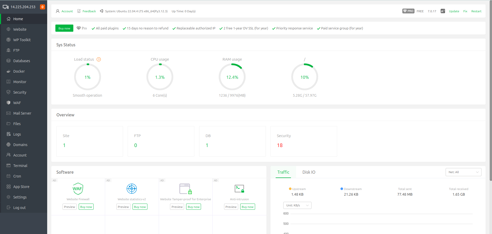
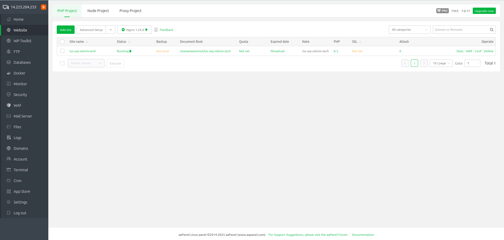
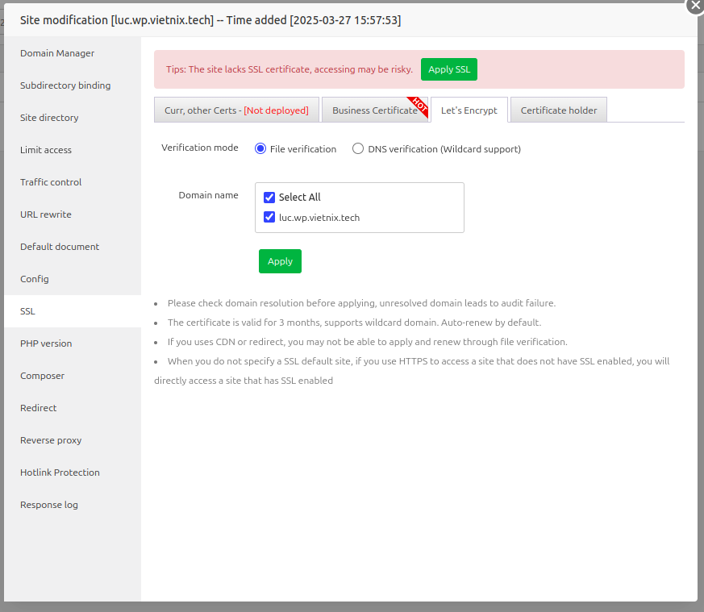
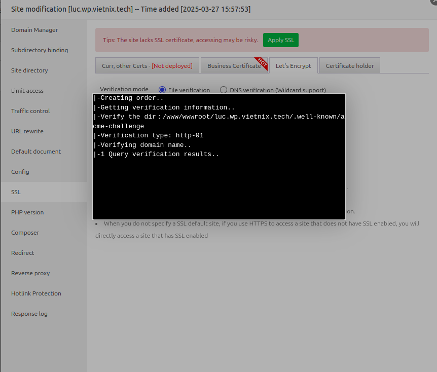
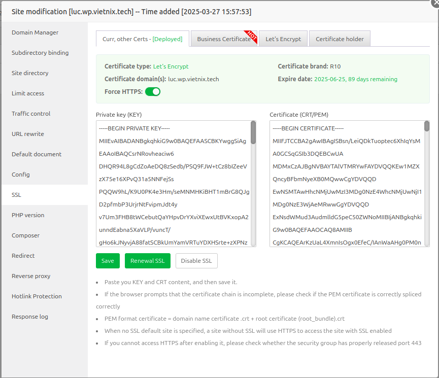

# Cài đặt SSL cho domain (domain sử dụng cho website wordpress)
#### Bước 1: Đăng nhập vào aaPanel Linux panel bằng tài khoản quản trị

#### Bước 2: Vào tab `Website`, sau đó tại domain cần cài ssl chon `Not Set` 

#### Bước 3: Tại bảng `Site modification` chọn mục `SSL`. Sau đó chọn tab `Let’s Encrypt`, ở mục `Verification mode` chọn `File verification`

- Tại mục Domain chọn domain muốn cấp SSL và chọn `Apply` sau khi cấu hình xong.
####

- Tiếp theo sẽ hiện ra cửa sổ chứng thực cài đặt SSL vào website. 
- Khi quá trình hoàn tất Let’s Encrypt SSL, hệ thống sẽ hiển thị một thông báo chi tiết về thời hạn của chứng chỉ, cũng như cung cấp private key và chứng chỉ tương ứng.
- Tại đây mở `Force HTTPS` để website tự động chuyển đổi về giao thức HTTPS.\
####

---

